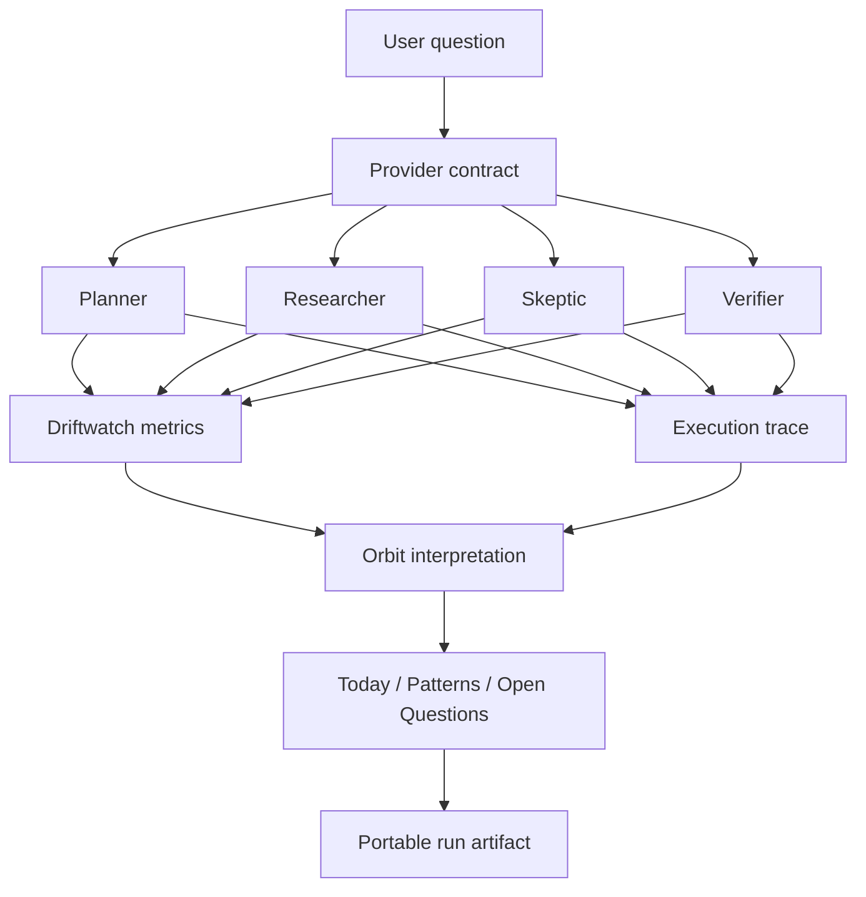

# Architecture

Orbit Driftwatch is divided into four responsibilities: provider boundary, orchestration, observability, and interpretation/provenance.



## 1. Provider boundary

`src/providers/` defines the contract between orchestration and an execution provider. Providers carry stable `id` and `version` fields and implement asynchronous `runAgents(question)`.

The current `deterministic-demo` provider is an offline fixture. Future hosted or local model providers must satisfy the same observation contract. Provider failures and malformed observations are explicit errors; the workflow does not fabricate substitute success output.

## 2. Orchestration

`src/orchestration/` owns execution state and the expected role order:

`Planner → Researcher → Skeptic → Verifier`

Each observation contains:

- role identity,
- user-visible summary,
- a bounded stance value for observability demonstrations,
- explicit claims,
- explicit support/evidence tags.

Provider-specific response objects must not leak past the provider boundary.

## 3. Driftwatch

`src/driftwatch/` computes mechanically defined telemetry from validated role observations.

Current disagreement is the normalized range of role stance values. Evidence coverage is the fraction of claims with both a supported flag and at least one evidence tag. Convergence is defined as `1 - disagreement`.

These definitions are intentionally simple and inspectable. They are not calibrated proxies for truth or answer quality.

## 4. Orbit + provenance

`src/orbit/` converts metrics and unresolved claim state into language a non-technical reviewer can understand:

- **Today** — what matters in the current run.
- **Patterns** — structural readings from the workflow.
- **Open Questions** — what remains unresolved.

`src/provenance/` exports completed runs using a versioned JSON schema. Deterministic runs intentionally omit a wall-clock timestamp so identical runs can serialize byte-for-byte identically.

## Boundary rules

1. UI cannot silently upgrade an unsupported claim to a verified one.
2. Telemetry cannot be labeled as factual accuracy without separate validation evidence.
3. Provider adapters cannot grant new authority to a role implicitly.
4. Provider failure or malformed output must become explicit failure state rather than fabricated output.
5. External source evidence, when added, must preserve source identity and claim binding.
6. Run artifacts must identify the provider and provider version that produced the observations.

## Provider topology

```text
Role observation contract
          ↑
          │
   Provider boundary
   ├─ deterministic demo (implemented)
   ├─ hosted model provider (planned)
   └─ local model provider (planned)
```

The deterministic provider remains useful after model integration as a stable test fixture and offline demonstration mode.
