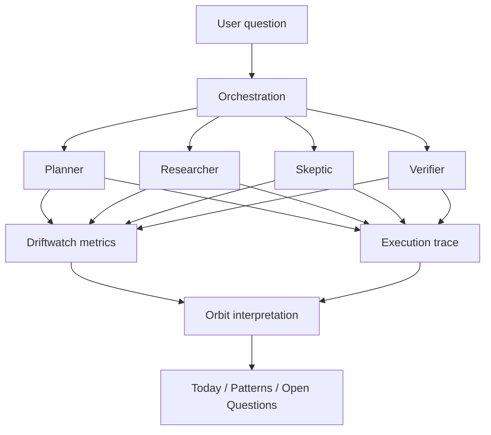

# Architecture

Orbit Driftwatch is intentionally divided into three responsibilities: orchestration, observability, and interpretation.



## 1. Orchestration

`src/orchestration/` owns execution order and role contracts. The current workers are deterministic fixtures so architecture can be tested without external credentials or non-deterministic model behavior.

The role contract is intentionally narrow:

- role identity,
- user-visible summary,
- a bounded stance value for observability demonstrations,
- explicit claims,
- explicit support/evidence tags.

A future model adapter should return this contract rather than allowing provider-specific response objects to leak into the rest of the system.

## 2. Driftwatch

`src/driftwatch/` computes mechanically defined telemetry from the role observations.

Current disagreement is simply the normalized range of role stance values. Evidence coverage is the fraction of claims with both a supported flag and at least one evidence tag. Convergence is defined as `1 - disagreement`.

These definitions are intentionally simple and inspectable. They are not presented as calibrated proxies for truth or answer quality.

## 3. Orbit

`src/orbit/` converts internal metrics and unresolved claim state into language a non-technical reviewer can understand.

The primary user model is:

- **Today** — what matters in the current run.
- **Patterns** — recurring or structural readings from the workflow.
- **Open Questions** — what remains unresolved and should not be silently promoted into a conclusion.

## Boundary rules

1. UI cannot silently upgrade an unsupported claim to a verified one.
2. Telemetry cannot be labeled as factual accuracy without separate validation evidence.
3. Provider adapters cannot grant new authority to a role implicitly.
4. Failure in an agent/provider must become explicit workflow state rather than fabricated output.
5. External source evidence, when added, must preserve source identity and claim binding.

## Planned provider boundary

```text
Role contract
     ↑
     │
ProviderAdapter
 ├─ deterministic demo (current)
 ├─ hosted model adapter (planned)
 └─ local model adapter (planned)
```

The deterministic adapter remains useful after model integration as a stable test fixture and offline demonstration mode.
